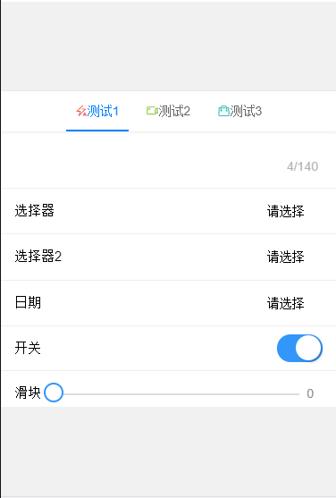
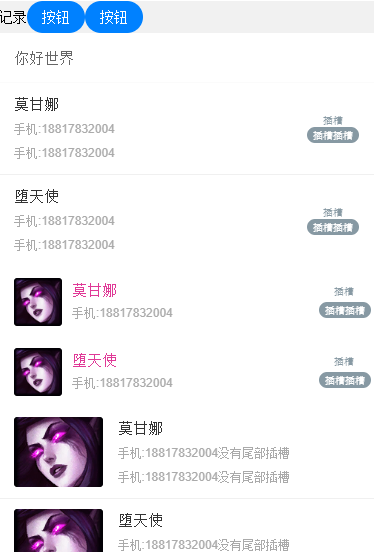
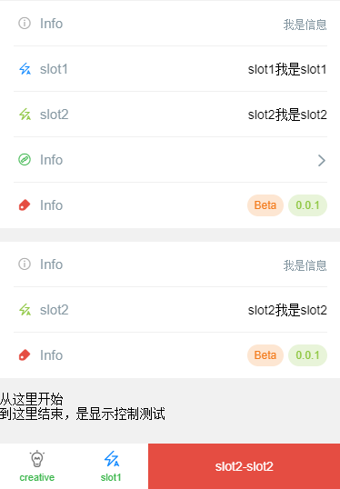
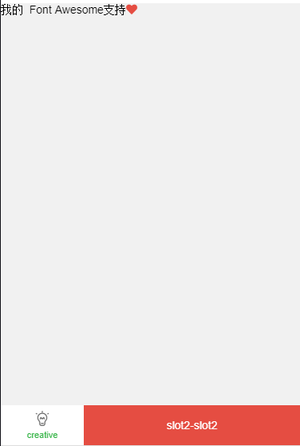

# ali-miniapp-ts-stylus-template

本模板采用`typescript`,`stylus`。

集成请求库[`wefech`](https://github.com/jonnyshao/wefetch)，集成样式库[`ColorUI`](https://github.com/weilanwl/ColorUI)，集成[`Font Awesome`](https://github.com/FortAwesome/Font-Awesome)

### 截图








## 使用方法

1. 开发前准备

```bash
# 安装依赖
yarn add

# 开发
yarn dev
```

2. 开发

  * VS code打开本项目。
  * 阿里小程序开发工具打开本项目`dist/`。

## 注意事项

### 组件引用相关

一处引用，处处使用

### gulp构建相关

开发目录位于`src/`，保存时`gulp`会编译复制`src/**/*.styl`和`src/**/*.ts`、复制`src/**/!(*.styl|*.ts|*.d.ts)`到`dist/`目录下。

其它注意事项可以查看`gulpfile.ts`

### typescript相关

使用 `export {}` 来表述这是一个`.ts`模块而不是全局脚本。详情参照`src/**/*.ts`。
