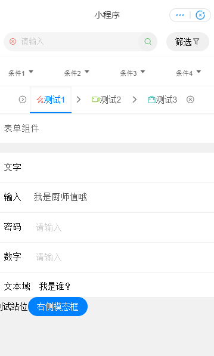

# ali-miniapp-ts-stylus

本模板采用`typescript`,`stylus`。

集成请求库[`wefech`](https://github.com/jonnyshao/wefetch)，集成样式库[`ColorUI`](https://github.com/weilanwl/ColorUI)，集成[`Font Awesome`](https://github.com/FortAwesome/Font-Awesome)

开箱即用——从框架到组件方便后端程序工程师开发前端小程序应用。
欢迎反馈。

## 开发框架

1. 支持`typescript`、`stylus`开发
2. 集成`请求库wefetch`、`样式库colorUI`、`图标库fontAwesome`

## 组件

内置11种组件，方便后端程序工程师开发前端小程序应用。

### 

1. 可配置表单Form：配置后可生成整个表单。内部支持文本、文本域、日期、开关、滑块、选择器；
2. 搜索条search-bar：内置选择器，搜索输入。简单配置即可使用。有尾部插槽。
3. 切换面板tabs：内置滚动面板。简单配置即可使用。有面板插槽,有切换条插槽。
4. 列表list：内置异普通列表、带小图列表、带大图列表。简单配置即可使用。有尾部插槽。
5. 卡片列表cardlist：简单配置即可使用，支持多选。有尾部插槽。
6. 模态框modal：上下弹出模态框，和左右抽屉。有插槽

### 支持权限过滤组件

7. 异步按钮asyncbutton：支持权限过滤。内置异步等待和确认面板。简单配置即可使用。
8. 格子列表gridlist：支持权限过滤。简单配置即可使用。有插槽。
9. 菜单列表menulist：支持权限过滤。简单配置即可使用，支持多选。有尾部插槽。
10. 底部条tabbar：支持权限过滤。简单配置即可使用，有插槽。
11. 条bar：简单配置即可使用，有插槽。

### 模板内组件




## 使用方法

1. 开发前准备

```bash
# 安装依赖
yarn add

# 开发
yarn dev
```

2. 开发

  * VS code打开本项目。
  * 阿里小程序开发工具打开本项目`dist/`。

3. `vscode`配置

点击菜单，依次进入文件、首选项、设置，在编辑器中编辑

加入对小程序文件的格式化支持
```json
{
    "files.associations": {
        "*.acss":"css",
        "*.wxss":"css",
        "*.axml":"html"
    },
    //... ...
}
```


## 注意事项

### 组件引用相关

一处引用，处处使用

### gulp构建相关

开发目录位于`src/`，保存时`gulp`会编译复制`src/**/*.styl`和`src/**/*.ts`、复制`src/**/!(*.styl|*.ts|*.d.ts)`到`dist/`目录下。

其它注意事项可以查看`gulpfile.ts`

### typescript相关

使用 `export {}` 来表述这是一个`.ts`模块而不是全局脚本。详情参照`src/**/*.ts`。
